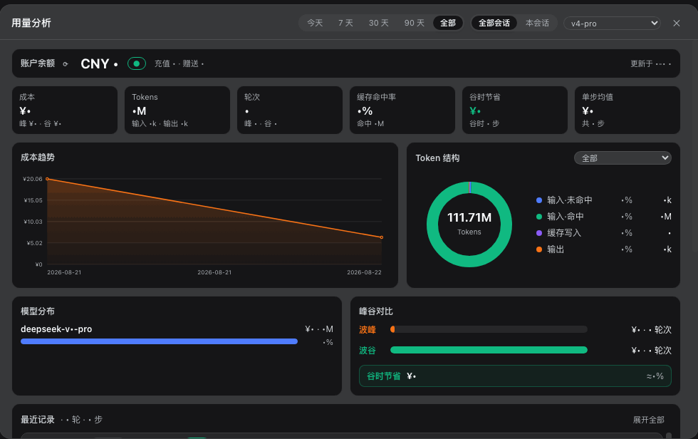

# dsh-client-ui-usage — DeepSeek Harness 사용량 분석 플러그인

> 🌐 Languages: [中文](README.md) · [English](README.en.md) · [日本語](README.ja.md) · **한국어** · [Español](README.es.md) · [Français](README.fr.md) · [Deutsch](README.de.md)

[](https://github.com/woosh2010/dsh-usage-dashboard/releases)
[](LICENSE)
[](https://github.com/woosh2010/dsh-usage-dashboard/stargazers)




> 📷 참고: 스크린샷은 중국어 UI 기준으로 표시되어 있습니다.

[DeepSeek Harness](https://github.com/deepseek-ai/deepseek-harness) Web(`dsh web`) 입력란 아래에 **피크/오프피크 과금 도크** 한 줄을 추가하고, 클릭하면 전체 **사용량 분석 대시보드**가 펼쳐집니다. 세션 전반의 토큰 / 비용 / 모델 / 피크·오프피크 데이터가 자동으로 저장되며, 전역 필터와 다차원 차트를 제공합니다.


## 기능

- **피크/오프피크 시간대별 과금**: 베이징 시간 기준 피크 시간(9:00–12:00 / 14:00–18:00)과 오프피크 시간(반값)으로 과금합니다. 도크에는 현재 시간대, 진행률 막대, 다음 가격 조정까지의 카운트다운, 세션 누적 / 이번 라운드 비용, 그리고 계정 잔액이 실시간으로 표시됩니다(60초 자동 새로고침, 공식 `/user/balance` 프록시를 경유하며 API Key는 브라우저 밖으로 나가지 않습니다).

  

- **이력 저장**: 각 단계의 토큰 / 비용 / 모델 / 피크·오프피크 정보가 `~/.dsh/storages/usage-history.jsonl`에 자동 기록되어 세션과 재시작을 넘어 유지됩니다(소프트 상한 4만 건, 오래된 항목 자동 정리).
- **전역 필터**: 패널 상단의 전역 옵션으로 모든 차트와 통계 카드가 실시간 연동됩니다 —
  - 시간 범위: 오늘 / 7일 / 30일 / 90일 / 전체
  - 세션 범위: 모든 세션 / 이 세션
  - 모델 필터: 모든 모델 / 단일 모델
- **통계 카드**: 비용(피크/오프피크 구분 포함), Tokens(입력/출력 포함), 라운드(피크/오프피크 포함), 캐시 적중률, 오프피크 절감액, 단계 평균.
- **분석 차트**:
  - 비용 추이 꺾은선 차트(마우스 오버로 당일 비용과 피크/오프피크 구분 확인)
  - Token 구성 도넛 차트(「전체 / 모델별」 전환 지원)
  - 모델 분포 막대 차트(전체 모델명 + 비용 비중)
  - 피크/오프피크 비교 및 오프피크 절감액
- **최근 기록**: 최근 **20라운드**의 모든 단계(기본 접힘, 라운드별 그룹, 라운드 제목에 모델 배지·피크/오프피크·비용 표시, 전체 펼치기/접기 지원, 영역 내 스크롤).

  

- **외부 클릭으로 닫기**: 패널은 React portal로 렌더링되며, 패널 밖 아무 곳이나 클릭하거나 Esc를 누르면 닫힙니다.

## 요구 사항

- DeepSeek Harness(dsh) `0.1.1-rc.1`의 `web` 프로필
- 잔액 표시를 위해서는 모델 설정 페이지에 DeepSeek API Key를 설정해야 합니다(미설정 시 잔액은 「—」로 표시되며, 나머지 기능에는 영향을 주지 않습니다)

## 설치

### 방법 1: 원클릭 설치(권장)

> **pnpm**이 필요합니다(`dsh plugin`은 인수를 pnpm에 그대로 전달하며, 프로필 디렉터리에서 실행됩니다).
> 없으면 먼저 설치하세요: `corepack enable pnpm`(Node에 corepack 내장) 또는 `npm install -g pnpm`.

GitHub Release에 있는 tarball을 한 줄의 명령으로 바로 설치합니다(실사용 확인됨):

```bash
dsh plugin --profile web add https://github.com/woosh2010/dsh-usage-dashboard/releases/latest/download/deepseek-ai-dsh-client-ui-usage.tgz
```

패키지가 `dsh.bundle.patch`를 선언하므로, `dsh plugin`이 자동으로 `@deepseek-ai/dsh-client-ui-usage`를 프로필의 `dsh.profile.bundles` 목록에 기록하고 `ui-usage` 항목으로 마운트합니다. 그런 다음 `dsh web`을 재시작하고 브라우저를 새로고침하세요.

> **방법 2/3에서 전환하는 경우**: `~/.dsh/profiles/web/cordis.patch.yml`에 수동으로 추가한 `ui-usage` insert 행을 먼저 삭제하세요. 그렇지 않으면 bundle patch와 수동 insert의 항목 id가 중복되어 충돌합니다.

### 방법 2: 다운로드 후 설치(오프라인/내부망)

1. 설치 패키지를 다운로드합니다([Releases](https://github.com/woosh2010/dsh-usage-dashboard/releases)에 있는 tgz 또는 `curl -LO <위 URL>`; `git clone` 후 `npm pack`으로 직접 만들 수도 있습니다).
2. tgz가 있는 디렉터리에서 실행합니다(경로 앞의 `./` 또는 절대 경로에 주의하세요. 파일명만 쓰면 pnpm이 npm 패키지명으로 인식합니다):

   ```bash
   dsh plugin --profile web add ./deepseek-ai-dsh-client-ui-usage.tgz
   ```

### 방법 3: 수동 설치

1. tarball을 프로필의 해석 경로에 압축 해제합니다:

   ```bash
   mkdir -p ~/.dsh/profiles/node_modules/@deepseek-ai/dsh-client-ui-usage
   tar -xzf deepseek-ai-dsh-client-ui-usage.tgz --strip-components=1 \
     -C ~/.dsh/profiles/node_modules/@deepseek-ai/dsh-client-ui-usage
   ```

2. `~/.dsh/profiles/web/cordis.patch.yml`에 항목을 추가합니다:

   ```yaml
   - insert:
       - id: ui-usage
         name: '@deepseek-ai/dsh-client-ui-usage'
   ```

3. `dsh web`을 재시작하고 브라우저를 새로고침합니다.

> 소스 디렉터리에서 직접 사용하는 경우: `lib/client.js`는 서버가 파일을 직접 읽으므로 클라이언트 변경은 브라우저 새로고침만으로 즉시 반영됩니다. `lib/index.js`(host 측 라우팅/저장소) 변경은 `dsh web` 재시작이 필요합니다.

## 자주 묻는 질문 (문제 해결)

### 업그레이드/설치 후 `dsh web`이 "declares no dsh.bundle" 오류로 시작되지 않음

**증상**: `dsh web`을 재시작하면 다음 오류와 함께 종료됩니다:

```
profile bundle "@deepseek-ai/dsh-client-ui-usage" declares no dsh.bundle in its package.json
```

**원인** (빈도순):

1. **이전 0.1.x 설치본(`dsh.client`만 선언하고 `dsh.bundle`이 없음)이 새 버전을 가리고 있습니다.**
   v0.4.0은 `dsh.bundle.patch`를 선언하므로 `bundles`에 등록하는 것은 전적으로 유효합니다. 그러나 dsh가
   프로필 디렉터리에서 패키지를 확인할 때 `~/.dsh/profiles/web/node_modules/@deepseek-ai/` 안의
   **심볼릭 링크**(`web/packages/` 아래의 이전 소스 복사본을 가리킴)가
   `~/.dsh/profiles/node_modules/@deepseek-ai/`(공유 스코프)의 새 파일보다 우선하므로,
   검증이 이전 package.json을 읽어 `declares no dsh.bundle`을 보고합니다.
   소스를 `web/packages/`에 복사했던 이전 수동 설치에서 업그레이드할 때 흔합니다.
2. **패키지 이름이 `dsh.profile.bundles`에 수동으로 추가됨** (프로필의 package.json을 직접 편집하여
   `dsh.bundle` 선언이 없는 버전으로 확인됨). bundle 등록은 `dsh plugin add`에 맡기고 직접 편집하지 마세요.

**해결 방법**:

1. 이전 잔여물 제거: `~/.dsh/profiles/web/packages/dsh-client-ui-usage`와
   `~/.dsh/profiles/web/node_modules/@deepseek-ai/` 아래의 심볼릭 링크를 삭제하거나 교체하여,
   모든 확인 경로가 (`dsh.bundle`을 선언하는) v0.4.0에 도달하도록 합니다.
2. 공식 한 줄 명령으로 재설치 (bundle 등록과 의존성을 자동 정리):

   ```bash
   dsh plugin --profile web add https://github.com/woosh2010/dsh-usage-dashboard/releases/latest/download/deepseek-ai-dsh-client-ui-usage.tgz
   ```

3. 프로필의 `cordis.patch.yml`에 수기 `insert`로 이 패키지를 마운트했다면 두 메커니즘 중
   **하나만** 유지하세요 (공식 bundles 등록을 권장하고 수기 insert는 삭제) — 이중 마운트 충돌을 방지합니다.
4. `dsh web`을 재시작하고 브라우저를 강력 새로고침합니다.

> 머신 이전 시에도 동일합니다: 이전 소스를 `web/packages/`에 설치하는 보조 스크립트(심볼릭 링크 경유 등)는
> 이 플러그인을 업그레이드하기 전에 반드시 정리해야 합니다. 그렇지 않으면 위의 확인 가림 문제가 발생합니다.

### 기타 설치 문제를 위한 빠른 자체 점검

시작 시 `bundles` 검증을 로컬에서 시뮬레이션합니다 (각 bundle이 `dsh.bundle`을 선언하는지,
클라이언트 전용 패키지가 `bundles`에 들어가지 않았는지 검사):

```bash
node -e '
const fs=require("fs"),path=require("path");
const D=path.join(process.env.HOME,".dsh/profiles/web");
const j=JSON.parse(fs.readFileSync(path.join(D,"package.json"),"utf8"));
let ok=true;
for(const n of j.dsh.profile.bundles){
  const m=JSON.parse(fs.readFileSync(require.resolve(n+"/package.json",{paths:[D]}),"utf8"));
  const has=!!(m.dsh&&m.dsh.bundle);
  console.log((has?"✓":"✗")+" "+n+" "+m.version); if(!has)ok=false;
}
const bad=["@deepseek-ai/dsh-client-ui-usage","@deepseek-ai/dsh-client-ui-gitpush"]
  .filter(n=>j.dsh.profile.bundles.includes(n));
if(bad.length)console.log("✗ 클라이언트 전용 패키지가 bundles에 포함됨:",bad),ok=false;
console.log(ok?"✅ 점검 통과":"❌ 점검 실패"); process.exit(ok?0:1);
'
```

## 검증

배포 후 실행:

```bash
node verify.mjs          # 기본값은 http://127.0.0.1:3080이며 baseUrl 인수를 전달할 수 있습니다
```

스크립트는 다음을 확인합니다: 전달된 클라이언트 파일과 배포 파일의 일치 여부, `modelsAll`과 모델별 토큰 구성, 세션/모델 필터링, 최근 20라운드, 각 모델 mix 합계와 총량 일치.

## 데이터 및 과금 안내

- **이력 저장소**: `~/.dsh/storages/usage-history.jsonl`, 소프트 상한 4만 건 자동 정리. 모델을 알 수 없는 기록은 프로젝션 캐시가 준비되면 자동으로 수정(재과금)됩니다.
- **가격표**: `lib/client.js`와 `lib/index.js`에 내장된 `PRICE_TABLE`(위안/백만 토큰, 피크·오프피크 두 단계; 캐시 적중은 적중 가격, 쓰기는 입력 가격). DeepSeek 가격 조정 후 이 두 곳을 함께 수정하면 됩니다.
- **오프피크 절감액**: 오프피크는 피크의 반값으로 계산되며, `오프피크 절감액 = 오프피크 누적 비용`.

## 스크린샷 다시 생성

`docs/screenshots/`의 스크린샷은 실제 실행 중인 `dsh web`에서 가져온 것입니다(잔액 숫자는 가림 처리됨). 다시 생성하는 방법:

```bash
# 1. 헤드리스 Chrome 실행(디버그 포트 9222)
"/Applications/Google Chrome.app/Contents/MacOS/Google Chrome" \
  --headless=new --remote-debugging-port=9222 --remote-allow-origins=* \
  --user-data-dir=/tmp/dsh-shot-profile --window-size=1440,900 about:blank

# 2. 캡처(DSH_CONV로 사이드바 세션 이름 지정 가능)
node scripts/screenshots.mjs dock
node scripts/screenshots.mjs dashboard
node scripts/screenshots.mjs recent
```

## 버전 이력

- **0.4.0**: 전역 필터(시간 범위 5단계 / 전체·이 세션 / 모델 필터), Token 구성 모델별 전환, 모델 분포 전체 이름 표시, 최근 20라운드(`turns` 매개변수), 통계 카드 보조 정보와 더 컴팩트한 레이아웃, 외부 클릭으로 닫기(portal + 오버레이), 최근 기록 기본 접힘.
- **0.3.3 / 0.1.0**: 최초 피크/오프피크 과금 도크, 계정 잔액 프록시, JSONL 이력과 집계 차트.

## License

[MIT](LICENSE)
