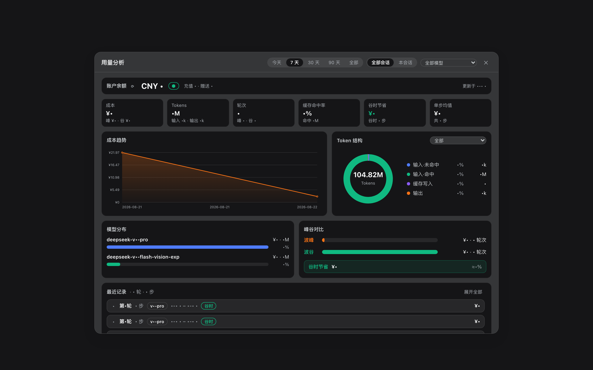
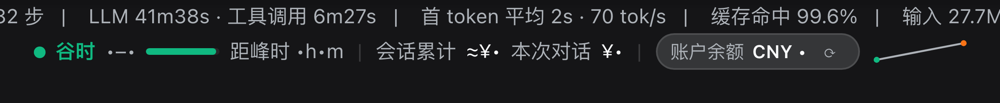
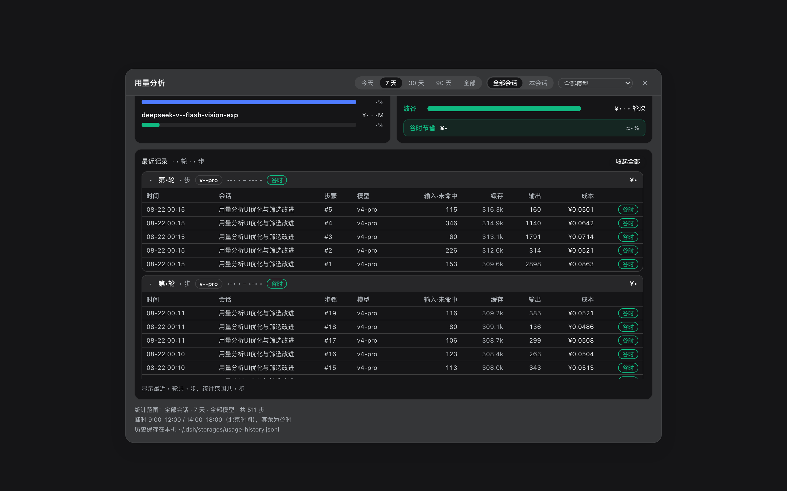

# dsh-client-ui-usage — DeepSeek Harness 用量分析插件

给 [DeepSeek Harness](https://github.com/deepseek-ai/deepseek-harness) Web（`dsh web`）输入框下方加一行**峰谷计费坞**，点击展开完整的**用量分析仪表盘**：跨会话的 token / 成本 / 模型 / 峰谷数据自动落盘，并提供全局筛选与多维图表。



## 功能特性

- **峰谷分时计费**：按北京时间峰时（9:00–12:00 / 14:00–18:00）与谷时（半价）计价；坞上实时显示当前时段、进度条、距下次调价倒计时、会话累计 / 本轮成本，以及当前会话模型与账户余额（60 秒自动刷新，走官方 `/user/balance` 代理，API Key 不出浏览器）。

  

- **历史落盘**：每一步 token / 成本 / 模型 / 峰谷自动写入 `~/.dsh/storages/usage-history.jsonl`，跨会话、跨重启保留（软上限 4 万条自动裁旧）。
- **全局筛选**：面板顶部的全局选项，所有图表与统计卡实时联动——
  - 时间范围：今天 / 7 天 / 30 天 / 90 天 / 全部
  - 会话范围：全部会话 / 本会话
  - 模型筛选：全部模型 / 单个模型
- **统计卡**：成本（含峰/谷拆分）、Tokens（含输入/输出）、轮次（含峰/谷）、缓存命中率、谷时节省、单步均值。
- **分析图表**：
  - 成本趋势折线（支持悬浮查看当天成本、峰谷拆分）
  - Token 结构环形图（支持「全部 / 按模型」切换）
  - 模型分布条形图（完整模型名 + 成本占比）
  - 峰谷对比与谷时节省
- **最近记录**：最近 **20 轮**的全部步骤（默认折叠、按轮分组，轮标题带模型徽章、峰谷与成本，支持展开/收起全部，区域内滚动）。

  

- **点外部关闭**：面板通过 React portal 渲染，点击面板外任意位置或按 Esc 关闭。

## 要求

- DeepSeek Harness（dsh）`0.1.1-rc.1` 的 `web` profile
- 余额显示需要在模型设置页配置过 DeepSeek API Key（未配置时余额显示「—」，其余功能不受影响）

## 安装

### 方式一：一键安装（推荐）

> 需要 **pnpm**（`dsh plugin` 把参数原样转发给 pnpm，在 profile 目录里执行）。
> 没有的话先装：`corepack enable pnpm`（Node 自带 corepack）或 `npm install -g pnpm`。

一条命令，直接安装 GitHub Release 里的 tarball（实测可用）：

```bash
dsh plugin --profile web add https://github.com/woosh2010/dsh-usage-dashboard/releases/download/v0.4.0/deepseek-ai-dsh-client-ui-usage-0.4.0.tgz
```

包声明了 `dsh.bundle.patch`，`dsh plugin` 会自动把 `@deepseek-ai/dsh-client-ui-usage` 写进 profile 的 `dsh.profile.bundles` 列表并挂载为 `ui-usage` 条目。然后重启 `dsh web` 并刷新浏览器。

> **从方式二/三切换过来**：先删掉 `~/.dsh/profiles/web/cordis.patch.yml` 里手工添加的 `ui-usage` insert 行，否则 bundle patch 与手工 insert 的条目 id 会重复冲突。

### 方式二：先下载再安装（离线/内网）

1. 下载安装包（[Releases](https://github.com/woosh2010/dsh-usage-dashboard/releases) 里的 tgz，或 `curl -LO <上面的 URL>`；也可以 `git clone` 后 `npm pack` 自建）。
2. 在 tgz 所在目录执行（注意路径前的 `./` 或绝对路径，直接写文件名会被 pnpm 当成 npm 包名）：

   ```bash
   dsh plugin --profile web add ./deepseek-ai-dsh-client-ui-usage-0.4.0.tgz
   ```

### 方式三：手动安装

1. 解压 tarball 到 profile 的解析路径：

   ```bash
   mkdir -p ~/.dsh/profiles/node_modules/@deepseek-ai/dsh-client-ui-usage
   tar -xzf deepseek-ai-dsh-client-ui-usage-0.4.0.tgz --strip-components=1 \
     -C ~/.dsh/profiles/node_modules/@deepseek-ai/dsh-client-ui-usage
   ```

2. 在 `~/.dsh/profiles/web/cordis.patch.yml` 增加条目：

   ```yaml
   - insert:
       - id: ui-usage
         name: '@deepseek-ai/dsh-client-ui-usage'
   ```

3. 重启 `dsh web`，刷新浏览器。

> 从源码目录直接使用：`lib/client.js` 由服务器按文件直读，客户端改动刷新浏览器即生效；`lib/index.js`（host 端路由/存储）改动需要重启 `dsh web`。

## 验证

部署后运行：

```bash
node verify.mjs          # 默认 http://127.0.0.1:3080，可传 baseUrl 参数
```

脚本会检查：下发的客户端文件与部署文件一致、`modelsAll` 与每模型 token 结构、会话/模型过滤、最近 20 轮、各模型 mix 求和等于总量。

## 数据与计价说明

- **历史存储**：`~/.dsh/storages/usage-history.jsonl`，软上限 4 万条自动裁旧；模型未知的记录会在投影缓存可用后自动修复（重新计价）。
- **价格表**：内置于 `lib/client.js` 与 `lib/index.js` 的 `PRICE_TABLE`（元/百万 tokens，峰谷两档；缓存命中按命中价、写入按输入价）。DeepSeek 调价后同步改这两处即可。
- **谷时节省**：谷时按峰时半价计，`谷时节省 = 谷时累计成本`。

## 重新生成截图

`docs/screenshots/` 里的截图来自真实运行中的 `dsh web`（余额数字已打码）。重新生成：

```bash
# 1. 启动无头 Chrome（调试端口 9222）
"/Applications/Google Chrome.app/Contents/MacOS/Google Chrome" \
  --headless=new --remote-debugging-port=9222 --remote-allow-origins=* \
  --user-data-dir=/tmp/dsh-shot-profile --window-size=1440,900 about:blank

# 2. 截取（可设置 DSH_CONV 指定侧栏会话名）
node scripts/screenshots.mjs dock
node scripts/screenshots.mjs dashboard
node scripts/screenshots.mjs recent
```

## 版本历史

- **0.4.0**：全局筛选（时间范围 5 档 / 全部·本会话 / 模型筛选）、Token 结构按模型切换、模型分布显示全名、最近 20 轮（`turns` 参数）、统计卡副信息与更紧凑布局、点击外部关闭（portal + 遮罩）、最近记录默认折叠。
- **0.3.3 / 0.1.0**：初始峰谷计费坞、账户余额代理、JSONL 历史与聚合图表。

## License

[MIT](LICENSE)
